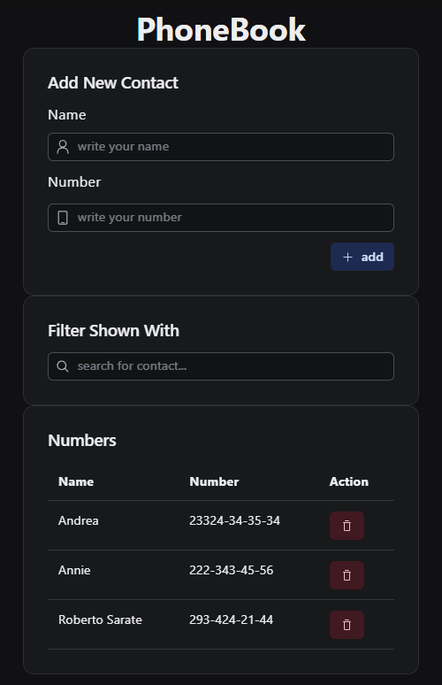
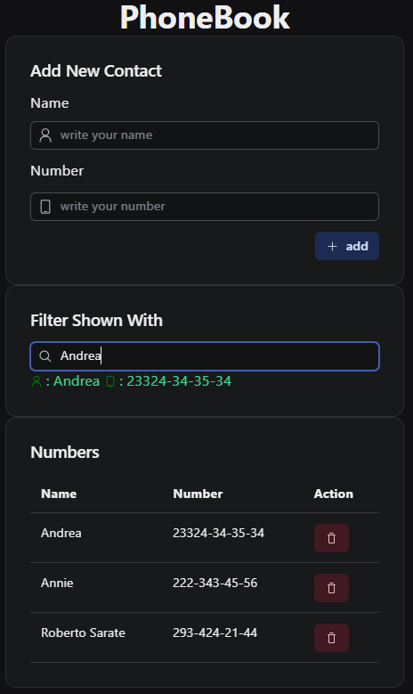

# apiPhoneBook

A REST API to manage the resources of a phonebook application. This exercise is part of the [Full Stack Open](https://fullstackopen.com/) course.

This project consists of a Node.js and Express backend that serves a REST API, and a React frontend to interact with it.

## Features

- View all contacts in the phonebook.
- Add new contacts with a name and phone number.
- Delete existing contacts.
- Update the phone number of an existing contact.
- Filter contacts by name in real-time.

## Technologies Used

### Backend

- **[Node.js](https://nodejs.org/)**: JavaScript runtime environment.
- **[Express](https://expressjs.com/)**: Web framework for Node.js.
- **[MongoDB](https://www.mongodb.com/)**: NoSQL database.
- **[Mongoose](https://mongoosejs.com/)**: ODM library for MongoDB and Node.js.
- **[CORS](https://www.npmjs.com/package/cors)**: Middleware to enable Cross-Origin Resource Sharing.
- **[Morgan](https://www.npmjs.com/package/morgan)**: Middleware for logging HTTP requests.
- **[Dotenv](https://www.npmjs.com/package/dotenv)**: To load environment variables from a `.env` file.

### Frontend

- **React**: A JavaScript library for building user interfaces.
- **Radix UI**: For unstyled, accessible UI components.
- **Axios**: Promise-based HTTP client for the browser and Node.js.

### Deployment

- **Fly.io**: Deployment platform.
- **Docker**: For containerization.
- **GitHub Actions**: For Continuous Integration and Continuous Deployment (CI/CD).

## API Endpoints

The base URL for the API is `https://apiphonebook.fly.dev/api/persons`.

| Method   | Endpoint | Description        |
| -------- | -------- | ------------------ |
| `GET`    | `/`      | Get all contacts.  |
| `POST`   | `/`      | Add a new contact. |
| `PUT`    | `/:id`   | Update a contact.  |
| `DELETE` | `/:id`   | Delete a contact.  |

## Screenshots

Aquí tienes una vista previa de la aplicación en acción.





## URL de la Aplicación

https://apiphonebook.fly.dev/

To run this project locally:

1.  Clone the repository:
    ```bash
    git clone https://github.com/guillmh/apiPhoneBook.git
    ```
2.  Install the dependencies:
    ```bash
    npm install
    ```
3.  Create a `.env` file in the root directory and add your environment variables (e.g., `MONGODB_URI`, `PORT`).
4.  Start the development server:
    ```bash
    npm run dev
    ```
